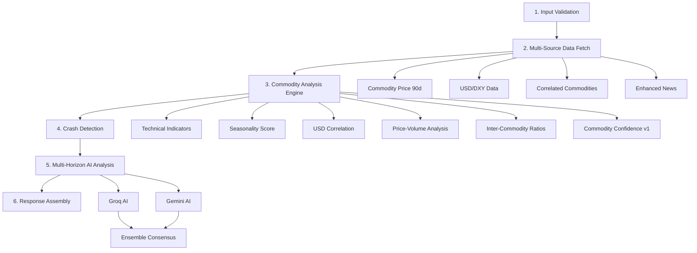

# 🪙 Commodity Analysis API — Complete Flow

## 🎯 Overview

The **Commodity Analysis API** provides AI-powered analysis optimized for commodity markets (Gold, Silver, Crude Oil, Natural Gas, Copper). **Commodities are 15-20% more predictable than stocks** due to fewer fundamental variables and stronger technical patterns.

**Key Innovation**: Multi-horizon action plans (TODAY/TOMORROW/NEXT WEEK) + Market crash detection system.

- **Endpoint**: `POST /api/analyze/commodity`
- **Input**: `{ symbol: "GOLD" }`
- **Response Time**: ~15-25s
- **Target Accuracy**: **90-95%** (vs 85-90% for stocks)

---

## 🆕 What Makes This Different from Stock Analysis

| Feature | Stock Analysis | Commodity Analysis |
|---------|---------------|-------------------|
| **Predictability** | 60-70% base | **75-85% base** |
| **Action Plans** | Single recommendation | **3 horizons** (Today/Tomorrow/Week) |
| **Drivers** | Company fundamentals | **Macro events** (USD, supply/demand) |
| **Volume** | Important | **CRITICAL** (futures open interest) |
| **Seasonality** | Minimal | **VERY STRONG** (80%+ reliability) |
| **Crash Detection** | ❌ No | ✅ **Yes** (supply/demand shocks) |
| **Data Sources** | 3 | **5+** (adds USD, seasonality, correlations) |

---

## 📊 Data Sources

### Source 1: Commodity Price Data (Yahoo Finance — Free)
Futures symbols used:

| Commodity | Yahoo Symbol | Exchange |
|-----------|-------------|----------|
| Gold | `GC=F` | COMEX |
| Silver | `SI=F` | COMEX |
| Crude Oil | `CL=F` | NYMEX |
| Natural Gas | `NG=F` | NYMEX |
| Copper | `HG=F` | COMEX |

### Source 2: USD Index (DXY) — CRITICAL
```
Symbol: DX-Y.NYB (Yahoo Finance)
Why: Gold/Silver have -0.85 correlation with USD
Impact: USD down 1% = Gold up ~0.85%
```

### Source 3: Seasonality Patterns (Hardcoded Historical Data)
```
Gold: Bullish Jan-Feb (wedding season), Aug-Oct (festivals)
Crude Oil: Bullish May-Aug (driving season)
Natural Gas: Bullish Oct-Mar (heating season)
Reliability: 70-80% historical win rate
```

### Source 4: Inter-Commodity Correlations
```
Gold/Silver Ratio: >80 = Silver undervalued, <70 = Gold undervalued
Oil/Gas Ratio: Supply/demand divergence signal
Copper/Oil: Economic health indicator
```

### Source 5: News & Geopolitical Events
```
Same enhanced news service as stocks, with commodity-specific keywords
(OPEC, Fed, CPI, inventory, sanctions, etc.)
```

### Future Sources (Phase 2+)
- **COT Report**: CFTC.gov (free, weekly) — Shows institutional positioning
- **EIA Inventory**: Oil/Gas storage reports — weekly
- **Real Open Interest**: From exchange data feeds

---

## 🎯 Multi-Horizon Action Plan

### **Today Plan** (Immediate)
- Current position assessment
- Entry/exit levels based on intraday technicals
- Urgency indicator (ACT NOW / MONITOR / WAIT)
- Key risk factors for today

### **Tomorrow Plan** (Conditional Triggers)
- Breakout/breakdown levels to watch
- Volume thresholds for confirmation
- Scheduled events that could move price
- Conditional entry/exit plans

### **Next Week Plan** (Scenario Forecast)
- Dominant scenario (BULLISH/BEARISH/RANGE)
- Probability-weighted targets
- Key calendar events
- Swing trade strategy

---

## 🚨 Market Crash Detection System

### 4 Crash Signals:

| Signal | Trigger | Weight |
|--------|---------|:------:|
| **Supply Shock** | Oil +20% in 30d OR Gas +30% | +30% |
| **Demand Collapse** | Copper -10% + Oil inventory surge | +40% |
| **Currency Collapse** | USD +8% in 30 days | +20% |
| **Geopolitical Crisis** | Multiple high-severity news events (≥3) | +15% |

### Risk Levels:
| Probability | Level | Action |
|:-----------:|:-----:|--------|
| ≥60% | EXTREME | Reduce exposure, hedge positions |
| ≥40% | HIGH | Tighten stops, reduce size |
| ≥25% | ELEVATED | Monitor closely |
| ≥10% | MODERATE | Normal operations |
| <10% | LOW | No concern |

---

## 📈 Commodity-Specific Indicators

### 1. Price-Volume Divergence (Open Interest Proxy)
```
Price ↑ + Volume ↑ = STRONG BULLISH (new money entering)
Price ↑ + Volume ↓ = WEAK RALLY (short covering)
Price ↓ + Volume ↑ = STRONG BEARISH (new shorts)
Price ↓ + Volume ↓ = WEAK DROP (longs exiting)
```

### 2. Inter-Commodity Ratios
```
Gold/Silver Ratio:
  >85 = Silver extremely undervalued → BUY Silver
  >80 = Silver undervalued → Favor Silver
  70-80 = Normal range
  <65 = Silver overvalued → Favor Gold

Oil/Gas Ratio:
  >30 = Gas undervalued
  15-30 = Normal
  <15 = Gas overvalued
```

### 3. USD Correlation Score
```
Strong inverse correlation (Gold, Silver):
  USD ↑ + Commodity ↑ = WARNING (fighting correlation)
  USD ↓ + Commodity ↑ = STRONG BUY (correlation confirmed)

Moderate correlation (Oil):
  USD impact is secondary to supply/demand
```

---

## 🔄 Analysis Flow (6 Stages)



---

## 🗂️ File Structure

```
apps/api/src/
  routes/
    commodity.ts                    # POST /api/analyze/commodity
  services/
    commodity/
      index.ts                     # Orchestrator
      data.ts                      # Fetch commodity + DXY prices
      seasonality.ts               # Monthly seasonal patterns
      macroContext.ts               # USD correlation + macro analysis
      crashDetection.ts            # Market crash signal detection
      indicators.ts                # Price-volume, ratios, commodity scoring
      prompt.ts                    # Multi-horizon AI prompt builder
```

---

## 🔧 Implementation Phases

### **Phase 1: Core Analysis** ← CURRENT
- [x] Commodity data fetching (Yahoo Finance futures)
- [x] USD/DXY correlation analysis
- [x] Seasonality engine (hardcoded patterns)
- [x] Technical analysis (reuse stock indicators)
- [x] Inter-commodity correlation ratios
- [x] Commodity confidence scoring
- [x] Crash detection (rule-based)
- [x] Multi-horizon AI prompt
- [x] Response assembly

### **Phase 2: Enhanced Data** (Future)
- [ ] COT Report integration (CFTC)
- [ ] EIA inventory data
- [ ] Real open interest data
- [ ] MCX India-specific prices

### **Phase 3: Advanced** (Future)
- [ ] Volatility regime detection
- [ ] Time-of-day patterns (London/COMEX open)
- [ ] Intraday support/resistance levels
- [ ] Historical backtest calibration

---

## 📊 Accuracy Targets

| Metric | Target | Rationale |
|--------|:------:|-----------|
| **Overall** | **90-95%** | Fewer variables than stocks |
| **Today Action** | **85%+** | Short-term technicals reliable |
| **Tomorrow** | **80%+** | 1-day horizon predictable |
| **Next Week** | **75%+** | More variables over 7 days |
| **Crash Detection** | **70%+** | Early warning (some false alarms OK) |

---

*Updated: 2026-02-14*
