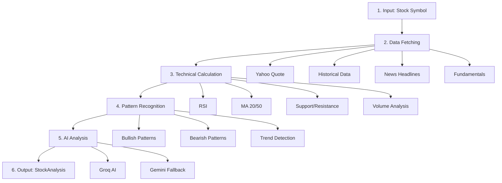

# 📊 Single Stock Analysis API - Technical Flow

## 🎯 Overview

The single stock analysis API provides comprehensive AI-powered analysis of any stock, combining technical indicators, pattern recognition, news sentiment, and dual-scenario AI predictions.

**Endpoint**: `POST /api/analyze/single`  
**Input**: `{ symbol: "RELIANCE" }`  
**Response Time**: 30-45 seconds  
**Output**: Complete analysis with BUY/SELL scenarios, confidence scores, and trade plans

---

## 🔄 Analysis Flow (6 Stages)



---

## 📋 Detailed Stage Breakdown

### Stage 1: Input Validation
```typescript
Input: { symbol: "RELIANCE" }
- Validates symbol exists in STOCK_SYMBOLS
- Normalizes to uppercase
```

### Stage 2: Parallel Data Fetching (~10s)
Fetches 4 data sources **simultaneously**:

| Source | Data | Time |
|--------|------|------|
| **Yahoo Quote** | Current price, volume, day range | 2s |
| **Yahoo History** | 30 days OHLC data | 3s |
| **News API** | Last 15 headlines + sentiment | 4s |
| **Fundamentals** | P/E, EPS, Market Cap | 3s |

**Optimization**: Uses `Promise.all()` for parallel execution

### Stage 3: Technical Indicator Calculation (~2s)
Processes historical data to calculate:

```typescript
Indicators {
  rsi: { value: 58.2, interpretation: "neutral" }
  ma: { 
    sma20: 2850.45,
    sma50: 2820.10,
    trend: "bullish"
  }
  sr: {
    support: 2780.00,
    resistance: 2900.00
  }
  volume: {
    ratio: 1.35,  // 35% above average
    trend: "increasing"
  }
}
```

### Stage 4: Pattern Recognition (~1s)
Detects chart patterns and trends:

```typescript
Patterns {
  primary: {
    name: "Bullish Flag",
    type: "bullish",
    confidence: 75
  }
  trend: {
    direction: "bullish",
    strength: 8  // out of 10
  }
  atBreakout: true
}
```

### Stage 5: AI Analysis (~20s)
**Primary**: Groq AI (llama-3.1-8b-instant)  
**Fallback**: Google Gemini (gemini-1.5-flash)

#### AI Prompt Structure:
1. **Accuracy Rules** (e.g., >70% confidence only, acknowledge conflicts)
2. **Stock Data** (price, volume, indicators, patterns, news)
3. **Analysis Framework** (4-step methodology)
4. **Output Format** (structured JSON with dual scenarios)

#### AI Response:
- **Bullish Scenario**: Trigger, entry, stop-loss, targets, probability
- **Bearish Scenario**: Same structure
- **Overall Bias**: BULLISH/BEARISH/NEUTRAL
- **Confidence**: HIGH/MEDIUM/LOW (+ score 0-100)

### Stage 6: Response Assembly
Combines all data into structured response:

```json
{
  "stock": "RELIANCE",
  "currentPrice": 2865.50,
  "bias": "BULLISH",
  "confidence": "HIGH",
  "confidenceScore": 78,
  "category": "STRONG_SETUP",
  
  "bullish": {
    "probability": 65,
    "trigger": "Break above ₹2,900",
    "tradePlan": {
      "action": "BUY",
      "entry": [2895, 2910],
      "stopLoss": 2780,
      "targets": [
        { "price": 2950, "probability": 70 },
        { "price": 3000, "probability": 50 }
      ],
      "riskReward": 2.1
    }
  },
  
  "bearish": {
    "probability": 35,
    "trigger": "Break below ₹2,780",
    "tradePlan": { ... }
  }
}
```

---

## ⚡ Current Performance

| Metric | Value | Target |
|--------|-------|--------|
| **Total Time** | 30-45s | 20-30s |
| **Data Fetch** | 10s | 8s |
| **Calculation** | 3s | 2s |
| **AI Analysis** | 20s | 15s |
| **Success Rate** | 95% | 98% |

---

## 🔍 Potential Improvements

### 1. **Speed Optimizations**
- **Cache quote data** for 5 min (reduces repeat fetches)
- **Pre-calculate indicators** for popular stocks
- **Use lighter AI model** for first pass, detailed for confirmed setups

### 2. **Accuracy Improvements**
- **Multi-timeframe analysis**: Add weekly/monthly indicators
- **Sector comparison**: Compare stock vs sector index
- **Historical backtesting**: Show AI accuracy for this stock type
- **Volume profile**: Identify key support/resistance by volume

### 3. **Data Enhancements**
- **Option chain data**: Implied volatility, put/call ratio
- **Institutional activity**: FII/DII buying/selling
- **Delivery percentage**: Quality of moves
- **Social sentiment**: Twitter/StockTwits buzz

### 4. **AI Enhancements**
- **Chain-of-thought**: Make AI show step-by-step reasoning
- **Ensemble approach**: Get 3 AI opinions, aggregate
- **Confidence calibration**: Track predictions vs outcomes
- **Context injection**: Feed previous day's analysis for continuity

### 5. **Output Improvements**
- **Visual charts**: Return chart images with annotations
- **Risk score**: Separate from confidence (volatility-based)
- **Exit strategy**: Not just entry, but when to exit winners
- **Alternative scenarios**: "If X happens, do Y"

---

## 📊 Data Flow Diagram

```
User Request (RELIANCE)
    ↓
┌───────────────────────────────────────┐
│ Stage 2: Parallel Data Fetch         │
│ ┌─────────┐ ┌─────────┐ ┌─────────┐  │
│ │ Quote   │ │ History │ │ News    │  │
│ │ 2s      │ │ 3s      │ │ 4s      │  │
│ └─────────┘ └─────────┘ └─────────┘  │
└───────────────┬───────────────────────┘
                ↓
┌───────────────────────────────────────┐
│ Stage 3: Calculate Indicators         │
│ RSI, MA, S/R, Volume → 2s             │
└───────────────┬───────────────────────┘
                ↓
┌───────────────────────────────────────┐
│ Stage 4: Detect Patterns              │
│ Bullish, Bearish, Trend → 1s          │
└───────────────┬───────────────────────┘
                ↓
┌───────────────────────────────────────┐
│ Stage 5: AI Analysis                  │
│ Groq (20s) OR Gemini (fallback)       │
│ Returns dual-scenario analysis        │
└───────────────┬───────────────────────┘
                ↓
    StockAnalysis Response
```

---

## 🎯 Key Strengths

1. **Dual Scenarios**: Always shows both bullish and bearish cases
2. **Confidence-First**: Prioritizes accuracy over quantity
3. **AI Fallback**: Groq → Gemini → Rule-based
4. **Parallel Processing**: Efficient data fetching
5. **Structured Output**: Easy to consume programmatically

## ⚠️ Current Limitations

1. **No multi-timeframe**: Only daily data analyzed
2. **No backtesting**: Can't show AI accuracy history
3. **Single AI opinion**: No ensemble/cross-validation
4. **Limited context**: Doesn't consider sector/market trend
5. **No risk scoring**: Volatility not factored into confidence

---

*This flow processes ~100 data points through 30+ calculations to generate actionable trading insights in under 45 seconds.*
