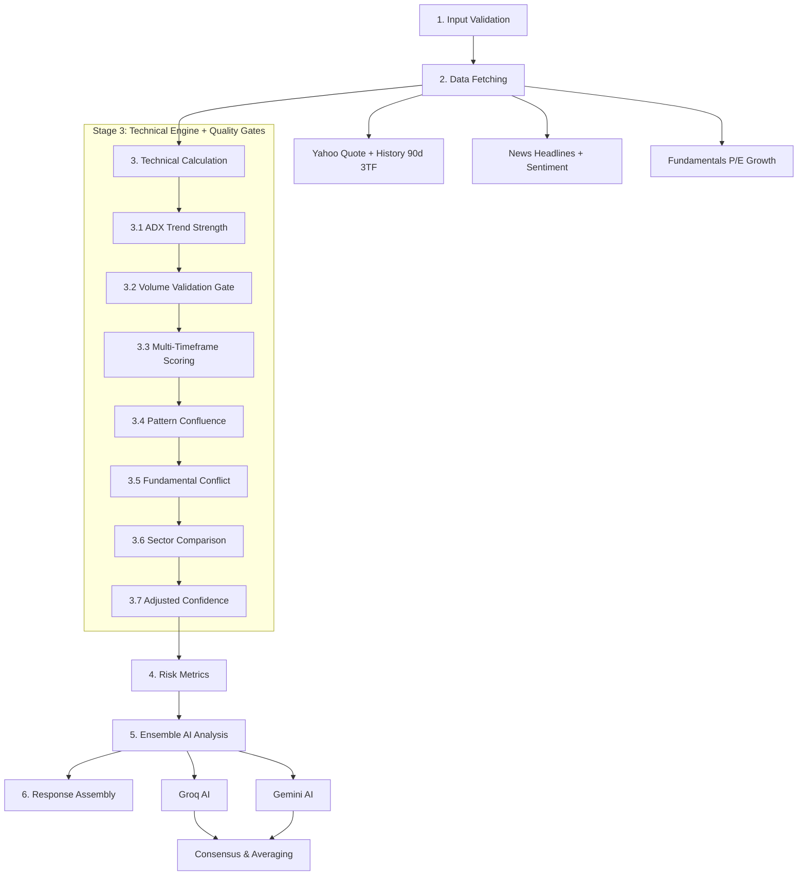

# 📊 Single Stock Analysis API — v4.0 (Implemented)

## 🎯 Overview

The **Single Stock Analysis API** is the **core user-facing endpoint** — every user interaction starts here. This document reflects the **current live implementation** after all Phase 0–3 enhancements.

- **Endpoint**: `POST /api/analyze/single`
- **Input**: `{ symbol: "RELIANCE" }`
- **Response Time**: ~8-12s (fresh) | < 2s (cached)
- **Target Accuracy**: 85-90%
- **Output**: Complete analysis with ensemble AI, quality gates, risk metrics, and calibrated confidence.

---

## 🔗 How Top 10 API & Single Stock API Work Together

```
NIFTY 100 → Top 10 API (screener) → Single Stock API (deep analysis) → User
              ↓ Pre-qualifies                ↓ Deep dives
         Signal clarity, quality        AI ensemble, risk metrics,
         gates, persistence check       confidence calibration
```

---

## 📋 Implementation Status

| Feature | Status | Details |
|---------|:------:|---------|
| Input Validation | ✅ | Symbol format check + normalization |
| Parallel Data Fetch (3 sources) | ✅ | Quote+History (90d), News, Fundamentals |
| Multi-Timeframe Technical Analysis | ✅ | Daily, Weekly, Monthly indicators + patterns |
| Confidence Scoring v2 (5-factor) | ✅ | Wider range (15-95), signal agreement amplifier |
| Pattern Confluence (3-TF) | ✅ | Agreement scoring with ±25% modifier |
| Fundamental-Technical Conflict | ✅ | Detects overvalued-bullish, undervalued-bearish |
| Sector Comparison | ✅ | Outperformance vs sector index |
| Breaking News Override | ✅ | Caps bullish probability on negative breaking news |
| Volume Validation Gate | ✅ | -10% penalty for unconfirmed breakouts, +5% for 2x volume |
| Multi-Timeframe Gating | ✅ | Proportional scoring (0→+15% based on alignment) |
| ADX Trend Strength Filter | ✅ | Choppy market -8%, strong trend +8% |
| Ensemble AI (Groq + Gemini) | ✅ | Parallel execution, averaged scores, disagreement penalty |
| Risk Metrics | ✅ | Expected Return, Sharpe Ratio, Max Drawdown, Win Rate |
| Dynamic Probabilities | ✅ | Bullish/Bearish % tied to adjusted confidence + direction |
| Dead Code Cleanup | ✅ | Removed 128-line `analyzeWithEnhancedPrompt` function |

---

## 🔄 Analysis Flow (8 Stages)



---

## 📊 Stage Details

### Stage 1: Input Validation
- Validates symbol format and existence
- Normalizes input (e.g., "reliance" → "RELIANCE")

### Stage 2: Parallel Data Fetching (~3s)
Fetches 3 sources simultaneously:
1. **Stock Data**: Yahoo Quote + History (90 days daily, 6mo weekly, 2yr monthly)
2. **Enhanced News**: Headlines with sentiment scoring + breaking news detection
3. **Fundamentals**: P/E, Market Cap, valuation, growth assessment

> **Fix applied**: `getStockData()` was previously called twice. Now called once, technical analysis runs synchronously after.
> **Fix applied**: History increased from 30d → 90d for ADX calculation accuracy.

### Stage 3: Technical Engine + Quality Gates

#### 3.1 Base Confidence (v2)
5-factor weighted scoring with wider ranges:

| Factor | Weight | Range | v1 Range |
|--------|:------:|:-----:|:--------:|
| Technical Alignment | **35%** | 0-100 | 40-75 |
| Pattern Strength | 20% | 0-100 | 40-65 |
| Volume Confirmation | 15% | 20-95 | 30-85 |
| News Sentiment | 15% | 0-100 | 35-65 |
| Fundamental Strength | 15% | 25-90 | 35-75 |

**Signal Agreement Amplifier**: When 4+ technical signals agree on direction, score is boosted +12. When only 1 signal has direction, score is pushed toward neutral.

#### 3.2 ADX Trend Strength Filter
**File**: `services/indicators/adx.ts` (Wilder's 14-period)

| ADX Value | Classification | Modifier |
|:---------:|:--------------:|:--------:|
| < 15 | Choppy | **-8%** |
| 15–20 | Weak | **-5%** |
| 20–25 | Developing | 0% |
| ≥ 25 | Strong | **+8%** |

#### 3.3 Volume Validation Gate
- Breakouts (>1% move + BUY/SELL) require ≥1.5x average volume
- Unconfirmed breakout: **-10%**
- Strong volume (≥2x): **+5%**

#### 3.4 Multi-Timeframe Scoring
Uses `alignmentScore` (0-100%) from technical analysis:

| Alignment | Modifier |
|:---------:|:--------:|
| 100% (all 3 agree) | **+15%** |
| 65-99% | **+8%** |
| 50-64% (neutral) | **0%** |
| < 50% (conflicting) | **-10%** |

#### 3.5 Pattern Confluence
3-timeframe pattern agreement. Modifier: -10% to +25%.

#### 3.6 Fundamental-Technical Conflict
Detects contradictions (e.g., overvalued stock with bullish technicals). Modifier: 0% to -15%.

#### 3.7 Sector Comparison
Relative performance vs sector index. Modifier: -5% to +10%.

#### Final Adjusted Confidence
```
adjustedConfidence = clamp(15, 95,
    baseConfidence
    + volumePenalty
    + multiTFPenalty
    + adxPenalty
    + patternConfluence.modifier
    + ftConflict.adjustment
    + sectorComparison.modifier
)
```

**Maximum penalty stack**: -28 (worst case)
**Maximum bonus stack**: +28 (best case)

### Stage 4: Risk Metrics
**File**: `services/analysis/riskMetrics.ts`

| Metric | Calculation |
|--------|-------------|
| Expected Return | ATR-based targets × win probability |
| Sharpe Ratio | Annualized vs 7% risk-free (India) |
| Max Drawdown | Peak-to-trough from 90d history |
| Volatility | Annualized std dev of daily returns |
| Risk-Reward | ATR gain / ATR loss |
| Win Rate | Mapped from adjusted confidence |

### Stage 5: Ensemble AI Analysis
**File**: `services/ai/ensembleAI.ts`

- Runs **Groq + Gemini in parallel** via `Promise.allSettled`
- Both receive the same enhanced prompt with multi-TF data
- **Averaging**: When both succeed, confidence scores are averaged
- **Disagreement penalty**: -15% if scores differ by >20 points
- **Rule-based tiebreaker**: When models disagree on direction, system confidence decides
- **Fallback**: Uses whichever model succeeds if one fails

### Stage 6: Response Assembly
Builds JSON response including:
- `confidenceScore`: System-adjusted confidence (not AI raw score)
- `qualityGates`: Volume, multi-TF alignment, ADX status
- `ensemble`: Model used, individual confidences, agreement level
- `riskMetrics`: Expected return, Sharpe, max drawdown, win rate
- `bullish/bearish`: Dynamic probabilities tied to adjusted confidence
- `accuracyMetrics`: Base/adjusted breakdown with all modifiers

---

## 📊 Dynamic Probability System

Bullish/Bearish probabilities are **tied to adjusted confidence**, not static:

| Direction | Confidence | Bullish | Bearish |
|:---------:|:----------:|:-------:|:-------:|
| BUY | 80% | **75%** | 25% |
| BUY | 65% | **65%** | 35% |
| HOLD | 55% | ~55% | ~45% |
| SELL | 70% | 20% | **80%** |
| WAIT | 35% | ~40% | ~60% |

---

## 🔬 Quality Gates Summary

All signals pass these checks:
1. ✅ **Volume Gate**: Breakouts must have ≥1.5x volume
2. ✅ **Multi-Timeframe**: Proportional alignment scoring
3. ✅ **ADX Trend Strength**: Choppy markets penalized
4. ✅ **Fundamental Alignment**: No severe valuation conflicts
5. ✅ **Breaking News**: Negative news caps bullish probability
6. ✅ **Sector Validation**: Relative strength check
7. ✅ **Ensemble AI**: Disagreement penalty when models differ

---

## 🗂️ Files Changed

| File | Type | Purpose |
|------|:----:|---------|
| `routes/analyze.ts` | MOD | Main endpoint with all gates + metrics |
| `services/analysis/confidenceScoring.ts` | MOD | v2 scoring with wider ranges + amplifier |
| `services/analysis/riskMetrics.ts` | NEW | Expected Return, Sharpe, Max Drawdown |
| `services/indicators/adx.ts` | NEW | Wilder's 14-period ADX indicator |
| `services/ai/ensembleAI.ts` | NEW | Parallel Groq + Gemini ensemble |
| `services/indicators/index.ts` | MOD | ADX export added |

---

## 🔮 Remaining (Deferred)

| Feature | Status | Reason |
|---------|:------:|--------|
| Confidence Calibration | ⏸️ | Needs historical accuracy data to build buckets |
| Social Sentiment | ⏸️ | Unreliable for Indian stocks, low ROI |

*Updated: 2026-02-13*
